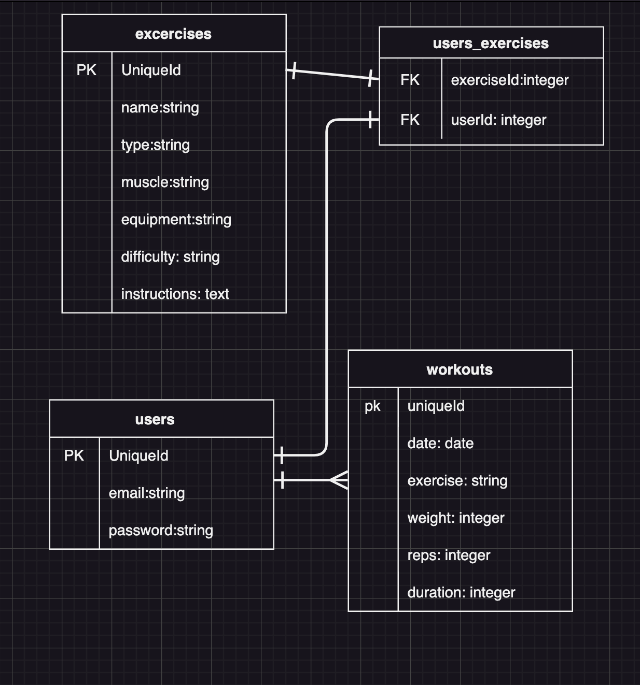
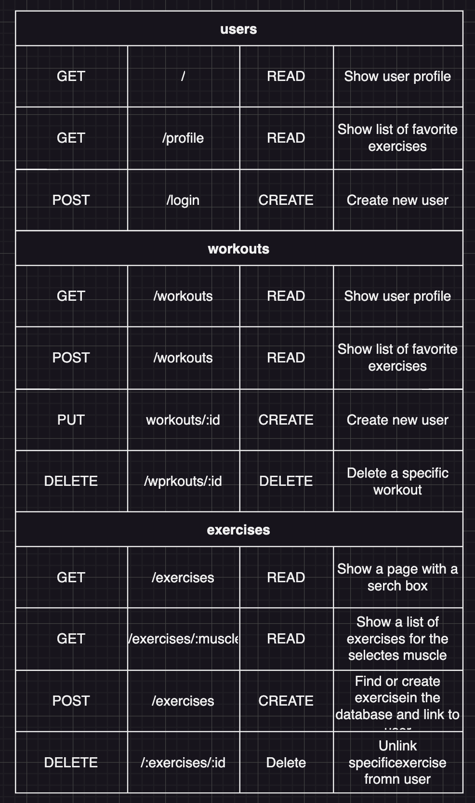
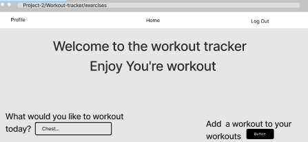

# Project 2 - -

### Project Idea and description
This will be a workout tracking app. The user would need to insert a muscle that you would like to work out, then the user should get back instructions on what to do. It should also give you the name of the workout with the name of the equipment that you will need.

### choice of API

 https://api-ninjas.com/api/exercises

### ERDs

### Restful Routing Chart

### Wireframes of all user views

### User Stories

* As a user, I desire to save data regarding my workouts.
* As a user, I desire to view every one of my earlier workouts. (up to x workouts)
* As a user, I desire to view every single one of my earlier workouts separately.
* As a user, I want to look for exercises that have examples and directions.
* As a user, I want to have a record of my preferred workouts.
 

### MVP Goals

* A working full-stack application.
* A way to be able to look for specifc workouts. 
* A way for the user to login in so they can view their saved workouts.
* A way for the user to be abel to delete a workout.

### Stretch Goals

* Be able to link either a picture or a video with diffrent workouts.
* Incorprate a way to insert someone's weight.
* Have a way to show the user a recommended workout 

### Sorces 
* passport-local
https://www.passportjs.org/packages/passport-local/

* https://developer.mozilla.org/en-US/docs/Learn/Server-side/Express_Nodejs/mongoose

* https://blog.appsignal.com/2022/09/14/secure-your-nodejs-app-with-json-web-tokens.html

* https://axios-http.com/docs/intro

* https://expressjs.com/en/resources/middleware/cookie-parser.html

